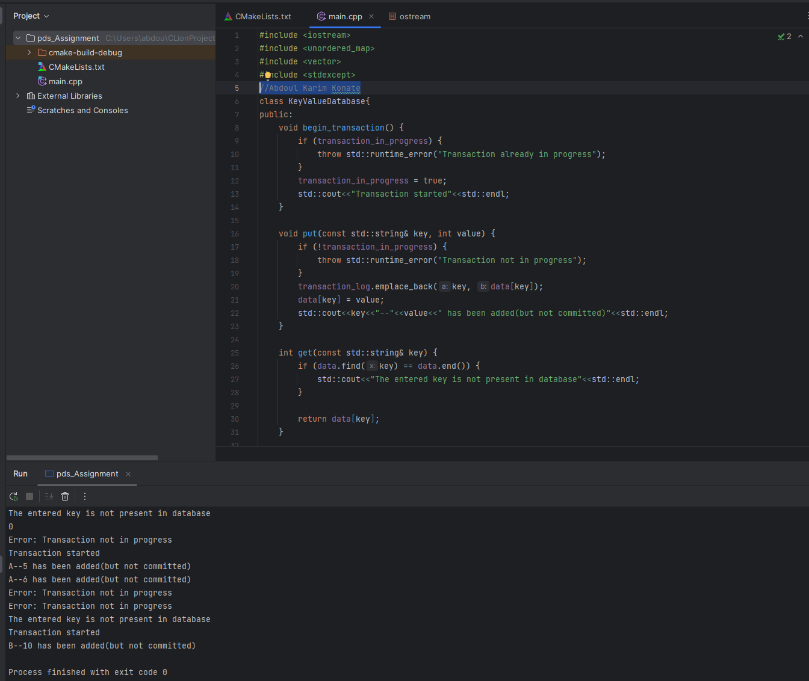

## Data-Processing-and-Storage-Assignment

### Running-Code
First, fork the reposition and clone it to your local machine, them open the file Data-Processing-and-Storage-Assignment (it contains pds_Assignment.cc and the readme page) 

```shell
## On Windows
1 - Using MinGW (Minimalist GNU for Windows):

2 - Compile pds_Assignment.cc
    $ g++ -o pds.exe pds_Assignment.cc

3  - Run The Compiled Code
    $ pds.exe

## On Mac or Linux
1 - Open command prompt at pds_Assignment directory, and Install a C++ compiler:
    $ sudo apt-get install g++

2 - Compile pds_Assignment.cc
    $ g++ -o pds pds_Assignment.cc

3  - Run The Compiled Code
    $ ./pds 
    
```

## Output


### Recommandation
This assignment turned out to be a great exercise on data processing. Although the assignment has a good structure, it could be more clear. On most coding exercises, we were presented with an expected output, I think a lot of questions could be answered by adding an expected output image.


